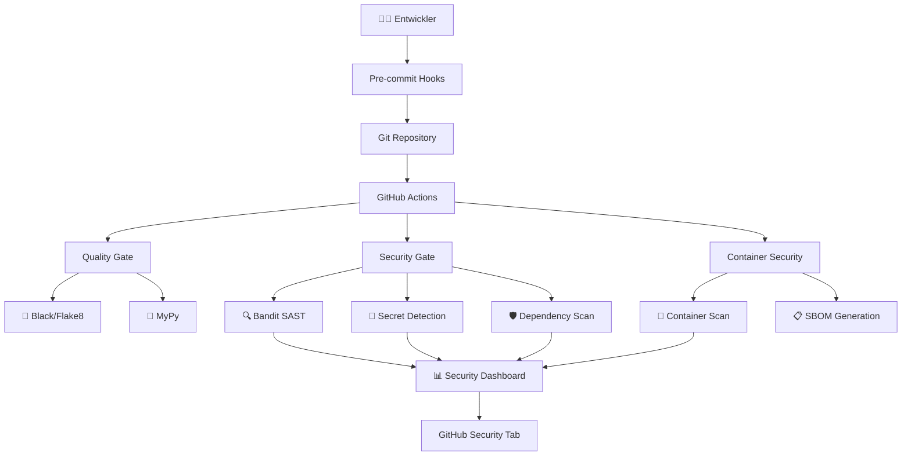

# 🛡️ DevSecOps Implementation Guide

## Übersicht

Dieses Dokument beschreibt die vollständige DevSecOps-Implementierung für den Spotify Auto-Discovery Bot. Das Setup folgt dem **"Shift Left"**-Prinzip und integriert Sicherheit in jeden Schritt des Entwicklungsprozesses.

## 🎯 DevSecOps-Ziele

- **Frühe Erkennung** von Sicherheitslücken (Shift Left)
- **Automatisierte Sicherheitsprüfungen** in CI/CD
- **Kontinuierliche Überwachung** von Dependencies
- **Compliance** mit OWASP und CWE Standards
- **Entwickler-freundliche** Security-Tools

## 🏗️ Architektur



## 🔧 Setup-Anleitung

### 1. Lokale Entwicklungsumgebung

```bash
# 1. Development Dependencies installieren
pip install -r requirements-dev.txt

# 2. Pre-commit Hooks aktivieren
pre-commit install

# 3. Erste Sicherheitsprüfung
pre-commit run --all-files
```

### 2. GitHub Repository Konfiguration

Nach dem Push zu GitHub werden automatisch aktiviert:

- ✅ **Dependabot**: Automatische Dependency Updates
- ✅ **CodeQL**: Erweiterte Code-Analyse
- ✅ **Security Advisories**: Vulnerability Benachrichtigungen

### 3. Branch Protection Rules (Empfohlen)

```yaml
# GitHub Repository Settings > Branches
Main Branch Protection:
  - Require status checks: ✅
  - Require branches to be up to date: ✅
  - Required status checks:
    - Security & Quality Gate
    - Container Security Scan
    - Pre-commit Hook Test
  - Require review from CODEOWNERS: ✅
  - Dismiss stale reviews: ✅
  - Require review from administrators: ✅
```

## 🔄 CI/CD Pipeline Details

### Pipeline 1: Quality Gate (Bei jedem Push/PR)

**Datei**: `.github/workflows/quality-gate.yml`

**Trigger**:
- Push zu main/master/develop
- Pull Requests
- Wöchentlich (Montags)

**Security-Checks**:
- 🎨 **Black**: Code Formatting
- 📋 **isort**: Import Organisation
- 📊 **Flake8**: Code Quality & Basic Security
- 🔍 **Bandit**: SAST (Static Application Security Testing)
- 🔐 **detect-secrets**: Secret Detection
- 🛡️ **pip-audit**: Dependency Vulnerability Scanning
- 🔬 **MyPy**: Type Checking

**Matrix Strategy**: Python 3.9, 3.10, 3.11

### Pipeline 2: Container Security (Bei Container-Änderungen)

**Datei**: `.github/workflows/docker-security.yml`

**Security-Checks**:
- 🔍 **Trivy**: Container Vulnerability Scanning
- 📄 **Hadolint**: Dockerfile Security Linting
- 🧪 **Runtime Tests**: Container Sicherheit zur Laufzeit
- 📋 **SBOM**: Software Bill of Materials
- 🔬 **Image Analysis**: Security Configuration

### Pipeline 3: Dependency Monitor (Täglich)

**Datei**: `.github/workflows/dependency-monitor.yml`

**Security-Checks**:
- 🔍 **pip-audit**: Moderne Vulnerability Detection
- 🛡️ **Safety**: PyUp.io Security Database
- 📜 **License Check**: License Compliance
- 📅 **Freshness**: Outdated Dependencies
- 📋 **SBOM**: Dependency Bill of Materials

### Pipeline 4: CodeQL Analysis (Wöchentlich)

**Datei**: `.github/workflows/codeql-analysis.yml`

**GitHub Advanced Security**:
- 🧬 **Semantic Analysis**: Tiefe Code-Analyse
- 🔍 **Security Queries**: OWASP-basierte Regeln
- 📊 **SARIF Upload**: Integration in GitHub Security Tab

## 🛠️ Security Tools im Detail

### SAST (Static Application Security Testing)

| Tool | Zweck | CWE-Abdeckung | Konfiguration |
|------|-------|---------------|---------------|
| **Bandit** | Python-spezifische Sicherheitslücken | CWE-78, CWE-89, CWE-798, etc. | `pyproject.toml` |
| **CodeQL** | Semantische Code-Analyse | Umfassend (1000+ Regeln) | `.github/workflows/codeql-analysis.yml` |
| **Flake8** | Code Quality + Basic Security | Style + Basic CWE | `.pre-commit-config.yaml` |

### SCA (Software Composition Analysis)

| Tool | Zweck | Database | Update-Frequenz |
|------|-------|----------|-----------------|
| **pip-audit** | Modern dependency scanning | OSV, PyPI | Real-time |
| **Safety** | PyUp.io vulnerability database | PyUp.io | Daily |
| **Dependabot** | Automated dependency updates | GitHub Advisory | Weekly |

### Container Security

| Tool | Zweck | Scan-Bereiche |
|------|-------|---------------|
| **Trivy** | Container vulnerability scanning | OS packages, Language libraries |
| **Hadolint** | Dockerfile security linting | Best practices, Security config |
| **SBOM** | Software Bill of Materials | Complete dependency tree |

## 📊 Security Monitoring

### GitHub Security Dashboard

**Zugriff**: Repository → Security Tab

**Bereiche**:
- 🚨 **Security Advisories**: Bekannte Vulnerabilities
- 🔍 **Code Scanning**: SAST Ergebnisse (Bandit, CodeQL)
- 🔗 **Dependabot**: Dependency Vulnerabilities
- 🔐 **Secret Scanning**: Leaked Credentials (GitHub Pro)

### Security Metriken

**Wöchentliche KPIs**:
- ✅ Critical Vulnerabilities: 0
- ✅ High Severity Issues: < 5
- ✅ Dependency Health: > 95%
- ✅ Code Coverage: > 80%
- ✅ Pipeline Success Rate: > 95%

## 🐛 Troubleshooting

### Häufige Probleme

**1. Pre-commit Hook Fehler**

```bash
# Problem: Hook schlägt fehl
# Lösung: Hooks aktualisieren
pre-commit autoupdate
pre-commit run --all-files
```

**2. Bandit False Positives**

```python
# Problem: Bandit meldet False Positive
# Lösung: Spezifische Regel deaktivieren
some_code()  # nosec B101
```

**3. Container Security Scan Fehler**

```bash
# Problem: Trivy findet kritische Vulnerabilities
# Lösung: Base Image aktualisieren
FROM python:3.11-slim-bookworm  # Neueste Version verwenden
```

**4. Dependency Vulnerabilities**

```bash
# Problem: Vulnerable dependency
# Lösung:
pip install --upgrade vulnerable-package
# Oder in requirements.txt pinnen:
# vulnerable-package>=safe-version
```

### Debug-Befehle

```bash
# Lokale Security-Scans
bandit -c pyproject.toml -r src/
detect-secrets scan --baseline .secrets.baseline
pip-audit --requirement requirements.txt

# Pre-commit Test
pre-commit run --all-files --verbose

# Container Security
docker build -t spotify-bot .
trivy image spotify-bot:latest
```

## 🔄 Wartung & Updates

### Wöchentliche Aufgaben

- [ ] GitHub Security Tab überprüfen
- [ ] Dependabot PRs reviewed und gemergt
- [ ] Security Pipeline Errors behoben
- [ ] Neue CVEs auf Relevanz geprüft

### Monatliche Aufgaben

- [ ] Security Baseline aktualisiert
- [ ] Tool-Konfigurationen reviewed
- [ ] Performance der Security-Pipelines optimiert
- [ ] Security-Dokumentation aktualisiert

### Vierteljährliche Aufgaben

- [ ] Umfassende Penetrationstests
- [ ] Security Tool Stack reviewed
- [ ] Compliance-Audit durchgeführt
- [ ] Security-Training für Entwickler

## 📚 Weiterführende Ressourcen

### Standards & Frameworks

- [OWASP DevSecOps Guideline](https://owasp.org/www-project-devsecops-guideline/)
- [NIST Secure Software Development Framework](https://csrc.nist.gov/Projects/ssdf)
- [OpenSSF Scorecard](https://securityscorecards.dev/)
- [CWE Common Weakness Enumeration](https://cwe.mitre.org/)

### Tools & Dokumentation

- [Bandit Documentation](https://bandit.readthedocs.io/)
- [GitHub Advanced Security](https://docs.github.com/en/code-security)
- [Pre-commit Framework](https://pre-commit.com/)
- [Trivy Scanner](https://trivy.dev/)

### Python Security

- [Python Security Guide](https://python-guide.readthedocs.io/en/latest/writing/security/)
- [OWASP Python Security](https://owasp.org/www-project-python-security/)
- [PEP 578 -- Python Runtime Audit Hooks](https://peps.python.org/pep-0578/)

## 🤝 Beitragen

### Security-Verbesserungen vorschlagen

1. **Issue erstellen**: Beschreibung des Security-Problems
2. **Branch erstellen**: `security/fix-description`
3. **Security-Tests hinzufügen**: Neue Tests für gefixte Vulnerabilities
4. **Pull Request**: Mit detaillierter Sicherheitsbeschreibung
5. **Security Review**: Durch Security-Team

### Security-Testing

```bash
# Vor jedem PR ausführen
./scripts/security-check.sh  # Wenn vorhanden
pre-commit run --all-files
bandit -c pyproject.toml -r src/
```

---

**🛡️ Sicherheit ist ein kontinuierlicher Prozess, kein einmaliges Ereignis!**

Bei Fragen oder Sicherheitsproblemen, siehe `SECURITY.md` für Kontaktinformationen.
